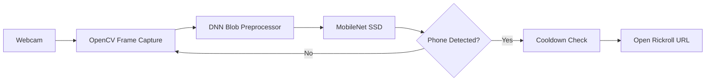

# Doomscrolling Blocker

A webcam-based focus enforcer that uses a pretrained MobileNet SSD object detection model to catch you reaching for your phone — and immediately plays Rickroll as a deterrent.

Built with Python and OpenCV, it runs entirely locally with no cloud dependencies.

## Features

- Real-time webcam feed with OpenCV
- MobileNet SSD (COCO class 77 — cell phone) detection
- Configurable confidence threshold and cooldown timer
- Auto-opens Rickroll URL in your default browser
- Zero cloud dependencies — runs fully offline after model download
- Lightweight: single Python file, minimal dependencies

## Tech Stack

| Layer | Technology |
|-------|-----------|
| Vision | OpenCV DNN + MobileNet SSD |
| Runtime | Python 3.11+ |
| Models | COCO pretrained (caffe) |

## Setup

```bash
git clone https://github.com/ramsidhartha/doomscrolling-blocker
cd doomscrolling-blocker
pip install -r requirements.txt
python download_models.py   # downloads MobileNet SSD weights
python main.py
```

Press `Q` to quit.

## Architecture



## Configuration

Copy `.env.example` to `.env` and adjust:

| Variable | Default | Description |
|----------|---------|-------------|
| `CAMERA_INDEX` | `0` | Webcam device index |
| `CONFIDENCE_THRESHOLD` | `0.55` | Detection confidence cutoff |
| `COOLDOWN_SECONDS` | `10` | Seconds between Rickroll triggers |

## Screenshots

> 📸 Screenshots coming soon

## Author

Ram Sidhartha
