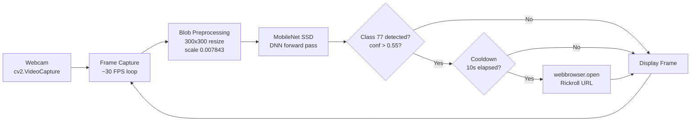

# Doomscrolling Blocker

[](https://github.com/isidhartha/doomscrolling-blocker/discussions)

I built this because I kept picking up my phone at my desk without even realising I was doing it. You know the thing — one second you're coding, the next you've been scrolling for 15 minutes and you don't know how you got there. So I wrote a script that watches my webcam and Rick-rolls me every time a phone shows up in frame.

It uses MobileNet SSD (Caffe pretrained on COCO) running through OpenCV's DNN module. Class 77 in the COCO taxonomy is "cell phone", so when the detector fires on that class with confidence above 55%, the script opens the classic YouTube link in your browser. There's a 10-second cooldown so you don't get launched into the same tab five times from one lazy handreach. The whole thing runs on CPU at a usable frame rate — no GPU, no cloud API, no subscription.

If you haven't downloaded the model files yet, it starts in demo mode: the webcam window opens and shows the feed but detection is skipped, so it doesn't crash on first run.

There's nothing sophisticated here. It's ~80 lines of Python, it either works or it doesn't, and when it does work it's surprisingly effective at building awareness of a habit you didn't know you had.

## Features

- **Real-time webcam phone detection** using OpenCV's DNN module with MobileNet SSD running on CPU at ~10-15 FPS
- **COCO class 77 lookup** — checks specifically for cell phones, not just any object above the confidence threshold
- **Configurable confidence threshold** via `PHONE_CONFIDENCE_THRESHOLD` constant (default 0.55) — raise it if you're getting false positives from TV remotes or dark objects
- **10-second cooldown** between punishment triggers so a single held-up phone doesn't spam your browser with new tabs
- **Live bounding box text** drawn on the webcam feed showing `PHONE DETECTED (82%)` in red whenever a phone is found
- **Rick Astley punishment** — opens `https://www.youtube.com/watch?v=dQw4w9WgXcQ` in your default browser via `webbrowser.open`
- **Demo mode fallback** — starts without crashing if model files are missing, just shows the webcam feed without detection
- **Press Q to quit** cleanly — releases the webcam capture handle and closes all OpenCV windows

## Tech Stack

| Library | Purpose |
|---|---|
| `opencv-python` | Webcam capture, DNN module inference, frame display and overlay |
| `numpy` | Frame array operations for DNN blob preprocessing |

## Setup

```bash
git clone https://github.com/isidhartha/doomscrolling-blocker.git
cd doomscrolling-blocker
pip install -r requirements.txt
```

Download the MobileNet SSD model files and place them in `models/`:

```
models/
  MobileNetSSD_deploy.prototxt
  MobileNetSSD_deploy.caffemodel
```

The files are available from the [MobileNet-SSD repository](https://github.com/chuanqi305/MobileNet-SSD). Without them the script starts in demo mode.

```bash
python main.py
```

Press `Q` to stop.

## Architecture



## Demo


<details>
<summary>Mobile / compact view</summary>


</details>


## Contributing

PRs welcome. Useful additions: configurable punishment URL via CLI flag, sound alert instead of browser tab, macOS/Linux testing notes, adjustable cooldown via argument.

See [CONTRIBUTING.md](CONTRIBUTING.md) for guidelines.

## License

MIT

## Author

[isidhartha](https://github.com/isidhartha)
