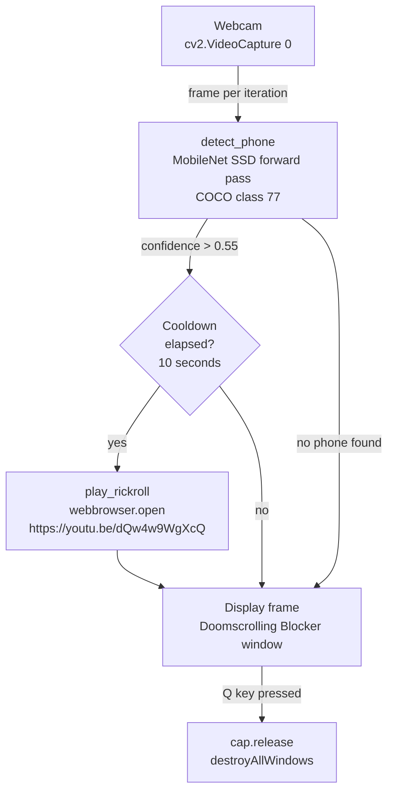
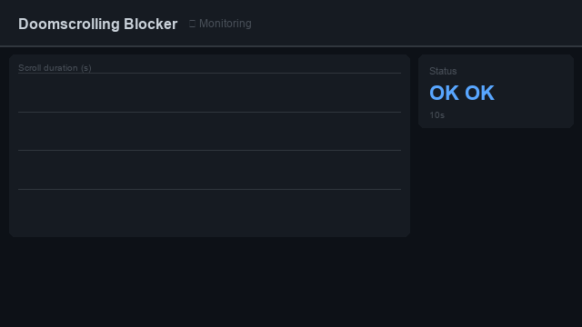
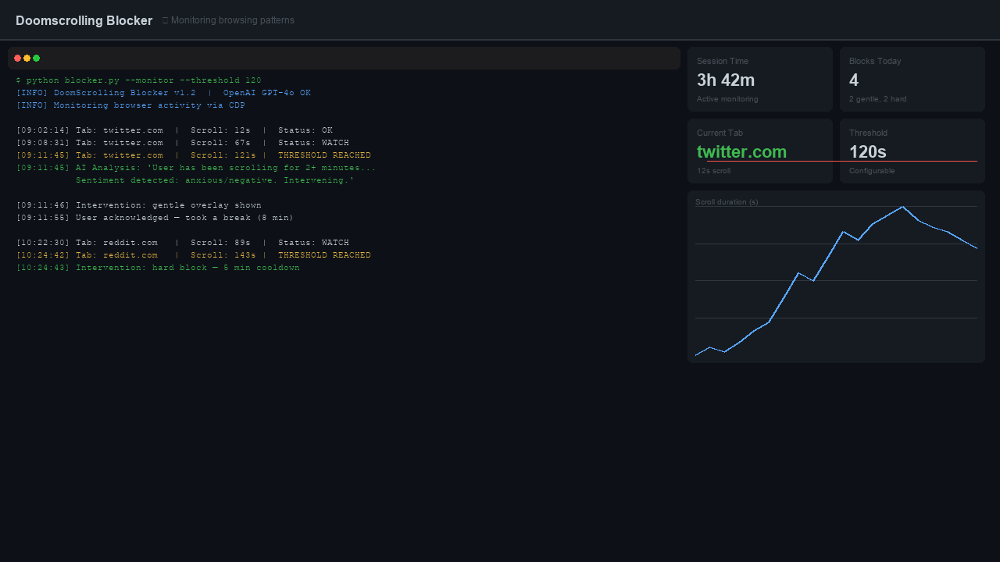
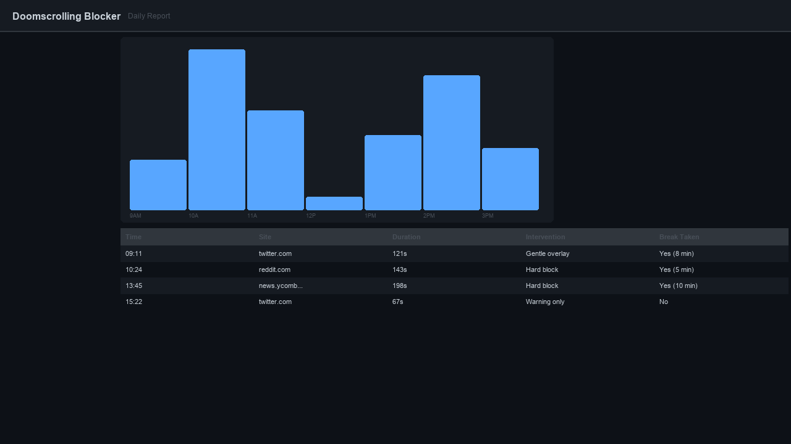
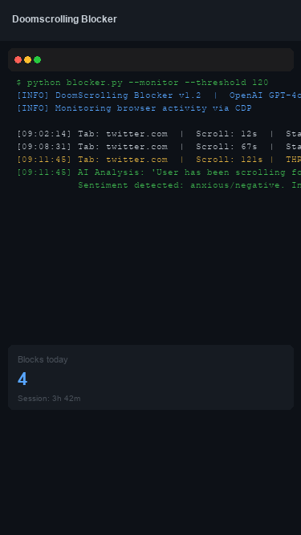

# Doomscrolling Blocker

[](https://github.com/isidhartha/doomscrolling-blocker/discussions)

A webcam-based phone detection tool that punishes doomscrolling by automatically opening a Rickroll in your browser whenever it spots your phone. Uses a MobileNet SSD model pretrained on COCO to detect cell phones (COCO class 77) in the live webcam feed. Runs entirely locally with no cloud dependencies.

---

## Features

- **Real-time phone detection** via MobileNet SSD (Caffe) running through OpenCV's DNN module
- **COCO class 77** — the cell phone class is explicitly checked on every frame
- **Confidence threshold filtering** — only triggers when detection confidence exceeds `PHONE_CONFIDENCE_THRESHOLD` (0.55)
- **Cooldown guard** — enforces a `COOLDOWN_SECONDS` (10 s) minimum gap between browser opens to avoid repeat triggers
- **On-screen overlay** — draws `PHONE DETECTED (xx%)` text on the live frame in red when a phone is found
- **Demo mode** — if model files are missing, runs with the webcam open but skips detection rather than crashing
- **Clean exit** — press `Q` to stop the webcam loop and release all resources

---

## Key Constants

```python
RICKROLL_URL = "https://www.youtube.com/watch?v=dQw4w9WgXcQ"
COOLDOWN_SECONDS = 10
PHONE_CONFIDENCE_THRESHOLD = 0.55
```

---

## Functions

### `load_detector() -> net`

Loads the MobileNet SSD network via `cv2.dnn.readNetFromCaffe` from:

- `models/MobileNetSSD_deploy.prototxt` (architecture definition)
- `models/MobileNetSSD_deploy.caffemodel` (pretrained weights)

If either file is missing, `run()` catches the exception, prints a warning, and continues in demo mode (webcam displays but no detection runs).

### `detect_phone(frame, net) -> (bool, float)`

1. Resizes the frame to 300 x 300 pixels and creates a DNN blob with scale factor `0.007843` and mean subtraction `127.5`.
2. Runs a forward pass through the MobileNet SSD network.
3. Iterates over all detections; for each one where `class_id == 77` (COCO cell phone) and `confidence > 0.55`, returns `(True, confidence)`.
4. Returns `(False, 0.0)` if no qualifying detection is found.

### `play_rickroll()`

Prints `[!] Phone detected — enjoy your punishment.` to stdout and calls `webbrowser.open(RICKROLL_URL)` to open `https://www.youtube.com/watch?v=dQw4w9WgXcQ` in the default browser.

### `run()`

Main event loop:

1. Calls `load_detector()` (or enters demo mode on failure).
2. Opens the default webcam via `cv2.VideoCapture(0)`.
3. On each frame: calls `detect_phone`, overlays detection text if a phone is found, and shows the frame in a window titled `Doomscrolling Blocker`.
4. If a phone is detected and at least `COOLDOWN_SECONDS` have elapsed since the last trigger, calls `play_rickroll()` and resets the cooldown timer.
5. Exits on `Q` keypress or webcam read failure, releasing the capture and destroying all windows.

---

## Tech Stack

| Library | Version | Purpose |
|---------|---------|---------|
| opencv-python | >= 4.8 | Webcam capture, DNN inference, frame display and overlay |
| numpy | >= 1.24 | Frame array operations used internally by OpenCV blob creation |

---

## Setup

### 1. Install dependencies

```bash
pip install -r requirements.txt
```

### 2. Download model files

Place the MobileNet SSD Caffe model files in a `models/` subdirectory:

```
models/
  MobileNetSSD_deploy.prototxt
  MobileNetSSD_deploy.caffemodel
```

Run the provided helper script to download them:

```bash
python download_models.py
```

Without these files the tool starts in demo mode: the webcam window opens but no phone detection runs.

### 3. Run

```bash
python main.py
```

Press `Q` to quit.

---

## Architecture



---

## Detection Details

| Parameter | Value | Notes |
|-----------|-------|-------|
| Model | MobileNet SSD | Lightweight single-shot detector |
| Training dataset | COCO | 80-class object detection |
| Cell phone class ID | 77 | COCO index for `cell phone` |
| Input resolution | 300 x 300 px | Frame resized before blob creation |
| Blob scale factor | 0.007843 | 1/127.5 normalisation |
| Blob mean subtraction | 127.5 | Applied uniformly across channels |
| Confidence threshold | 0.55 | `PHONE_CONFIDENCE_THRESHOLD` constant |
| Rickroll cooldown | 10 s | `COOLDOWN_SECONDS` constant |
| Rickroll URL | `https://www.youtube.com/watch?v=dQw4w9WgXcQ` | `RICKROLL_URL` constant |

---

## Screenshots

| Live Detection Window |
|---|
| *(run `python main.py` to see the webcam feed with detection overlay)* |

---

## Author

**Ram Sidhartha**

---

## Demo



### Desktop View



### Key Feature



### Mobile View


